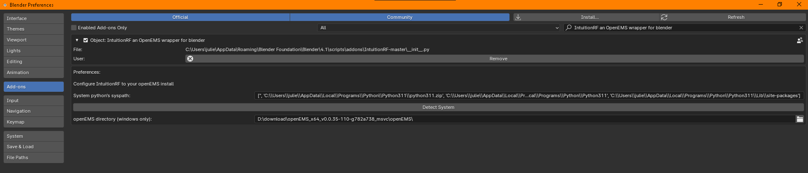

# IntuitionRF
IntuitionRF is an OpenEMS wrapper plugin for blender aiming to make dealing with RF simulation more intuitive. 

OpenEMS project page : https://www.openems.de/

## Example


## Contents
- [IntuitionRF](#intuitionrf)
  - [Example](#example)
  - [Contents](#contents)
  - [Install](#install)
    - [1. Install OpenEMS](#1-install-openems)
    - [2. Install Additionnal python deps](#2-install-additionnal-python-deps)
    - [3. Install this plugin](#3-install-this-plugin)
    - [4. Enable the addon](#4-enable-the-addon)
    - [5. Reload plugins](#5-reload-plugins)
    - [6. Properties](#6-properties)


https://www.youtube.com/watch?v=oCE_hrCGen4
[](https://www.youtube.com/watch?v=oCE_hrCGen4)


## Install 
### 1. Install OpenEMS 
IntuitionRF does not provide a OpenEMS distribution, you have to install a version yourself.

[Install Instructions for OpenEMS](https://docs.openems.de/install/index.html)

Requirements:
- OpenEMS must be built with python interface enabled 
- OpenEMS must be built against the same python version blender is using

### 2. Install Additionnal python deps
Additional Python dependencies: 
```bash 
pip install vtk
pip install matplotlib
pip install numpy 
pip install h5py
```
Once you have the python examples from OpenEMS running, 

### 3. Install this plugin
Download this repo as ```.zip``` file then install as a regular addon

### 4. Enable the addon
1. Enable the addon 


2. put your OpenEMS's python version syspath into this.

-  If you compiled OpenEMS against your system's python version, you can use the 'detect systen' to get the syspath automatically

- If you compiled OpenEMS against a virtualized environment (conda, venv, ...) then run the following in the python interpreter :
```python 
import sys 
print(sys.path)
```

then copy the output to the addon's configuration syspath

### 5. Reload plugins

Use blender's 'reload scripts' (F3->reload scripts). The plugin should now be ready. If not, try restarting blender


### 6. Properties
You should now see new IntuitionRF properties panels under the 'object' and 'scene' categories.


### Install procedure on Windows with pre-built OpenEMS distribution
#### OpenEMS
If you choose to use the binary distribution for OpenEMS on windows here are the steps you need to follow. 

- make sure you download the OpenEMS binaries with python bindings
- install the python libraries as per OpenEMS's install instructions


```bash 
pip install numpy matplotlib vtk h5py
cd LETTER:/your/OpenEMS/extract/dir/python 
pip install openEMS-0.0.33-cp311-cp311-win64_amd64.whl
pip install CSXCAD-0.6.2-cp311-cp311-win64_amd64.whl
```

#### install the addon
install then enable the addon


#### configure the addon
You need to configure the system python's syspath and openEMS install dir


1. syspath 
Open python in a terminal, then 
```python
import sys 
sys.path
```


copy the path, paste it into the syspath

2. OpenEMS DLL directory 
Open the file dialog, and select the directory with OpenEMS's DLL files


Addon is now configured



restart blender

#### check install
Open blender CLI output, this is where you can see what's going on in openEMS


You should have the new properties panels


